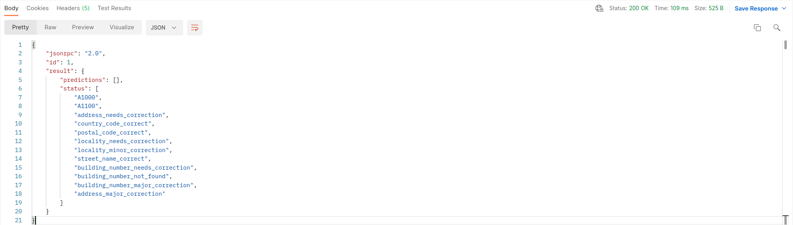

# Endereco API

Endereco API stellt einen elektronischen und automatisierbaren Zugang zu den [Leistungen der Firma Endereco UG (haftungsbeschränkt)](https://www.endereco.de/services/) her. 
Darunter fällt unter anderem die Prüfung der Adressen, E-Mail Adressen und Telefonnummern.

## Über 200 Unternehmen prüfen ihre Stammdaten mit Endereco

Egal ob Onlineshop, Warenwirtschaftssystem oder eigene Entwicklung, Endereco kümmert sich um die Qualität der Daten und spart ihren Kunden den Mehraufwand durch schlechte Stammdaten. 

Unsere Referenzen:

|  |  |  |  |
|---|---|---|---|
|  |  |  |  |
|  |  |  |  |

## Plugins und fertige Intergrationen

Neben der API entwickeln wir und unsere Integrationspartner fertige Lösungen für diverse Systeme.

||||
|---|---|---|
| [Shopware 5 Plugin](https://github.com/Endereco/endereco-shopware5-client) | [Shopware 6 Plugin](https://github.com/Endereco/endereco-shopware6-client) | [OXID eSales 4 Modul](https://github.com/Endereco/endereco-oxid4-client) |
| [OXID eSales 6 Modul](https://github.com/Endereco/endereco-oxid6-client) | [JTL Shop 4 Plugin](https://github.com/Endereco/endereco-jtl4-client) | [JTL Shop 5 Plugin](https://github.com/Endereco/endereco-jtl5-client) | 
| [WordPress/WooCommerce Plugin](https://github.com/Endereco/endereco-wp5-client) | [Magento 2 Webshop Extension](https://www.endereco.de/magento/) | [Plentymarkets Extension](https://www.endereco.de/plentymarkets/) | 
| [DreamRobot App](https://www.endereco.de/dreamrobot/) |  |  |

Wenn du Interesse an einem/r neuen Plugin/Integration hast, sende eine kurze E-Mail an ilja@endereco.de.

## DSGVO konform und versichert

Unsere API ist DSGVO konform. Wir haben einen TÜV-Zertifizierten Datenschutzbeauftragen im Haus und bemühen uns stets die aktuellsten gesetzlichen Anforderungen an Datenschutz umzusetzen.

Des Weiteren stehen wir mit einer Betriebshaftungsversicherung für mögliche Schaden unsererseits gerade.

## Vorbereitung

Wenn du die API nutzen willst, dann kannst du so vorgehen:

1. Frage [über diese Form](https://share.hsforms.com/1Hez4RJSYQt2EFH_tdnCjsw3e78w) oder über E-Mail Kontakt info@endereco.de oder support@endereco.de nach einem API-Key. Für einen API-Key wirst du mit Endereco einen AV-Vertrag abschließen müssen: nur so dürfen wir deine Daten prüfen.
2. Probiere unsere [Postman-Collection](https://todo.com) aus. Dort sind alle gängige Anfragen schon vorformuliert. Die [Import-Datei](https://todo.com) wurde für die aktuelle Version von [Postman](https://www.postman.com/) erstellt.
3. Falls du noch Fragen hast, suche dir den Ansprechspartner aus der Liste unten.

### Ansprechspartner
| Art der Frage | zuständige Person | Kontakt |
|---|---|---|
| geschäftliche/finanzielle Frage | Robert Rieser  | robert@endereco.de oder info@endereco.de |
| technische Frage | Ilja Weber | ilja@endereco.de oder suppoert@endereco.de  |
| Frage zu Datenschutz | Lena Schmitt | lena@endereco.de oder datenschutz@endereco.de |

## Übersicht der Funktionen

| Adresse | E-Mail Adresse | Person |
|---|---|---|
| [Adressprüfung](#prüfung-einer-adresse-mit-getrennten-straßehausnummer) | E-Mail Prüfung | Namensprüfung |
| PLZ Vorschläge | | |
| Ortsvorschläge | | |
| Straßenvorschläge | | |

| Telefonnummer | IBAN | Umsatzsteuer ID |
|---|---|---|
| Rufnummerprüfung | IBAN-Prüfung | Umsatzsteuer ID Prüfung |

| technische Methoden |
|---|
| Abschluss einer Session |
| Abschluss einer Konversion |

## Übersicht der Statuscodes

In der Antwort der API wird i.d.R. eine Liste von Statuscodes zurückgegeben. 



Diese Statuscodes beschreiben den geprüften Datensatz und diktieren weiter folgende Reaktion. Die [vollständige Liste der Statuscodes](./statuscodes.md) ist hilfreich für Entwickler, die die Prüfungen von Endereco tief in ihre Geschäftsprozesse integrieren wollen.

Vorgesehene Reaktion auf bestimmte Statuscodes ist in [UI Guidelines](./ui-guidelines.md) beschrieben. Diese ist für UI Entwickler/Designer nützlich.

## Request oder Session

Die Leistungen von Endereco sind kostenpflichtig. Die einfachste Art der Abrechnung ist, wenn man pro Anfrage einen gewissen Betrag zahlt.

Endereco versucht jedoch dem Nutzer entgegenzukommen und einen Betrag erst dann in Rechnung zu stellen, wenn dieser tatsächlich einen Mehrwert bringt. Wir nennen es "erfolgsbasierte Abrechnung". Erst wenn ein bestimmter logischer Datensatz (z.B. eine Lieferadresse) nach der Verarbeitung durch Endereco gespeichert wird, rechnen wir ab.

Um die erfolgsbasierte Abrechnung zu nutzen, müssen die sog. Sessions umgesetzt werden. Dafür haben wir [eine Anleitung](./generating-sessions.md) erstellt. Es ist empfehlenswert sie zu lesen, da wir die Umsetzung abnehmen müssen. Wenn du dazu noch Fragen hast, melde dich bei unseren [Ansprechspartnern](#Ansprechspartner).

## Authentifizierung

Jede Anfrage, die bei uns ankommt, muss einem Nutzer zugeordnet werden können. Dafür in ein HTTP Header "X-Auth-Key" vorgesehen. Dieser muss bei jeder Anfrage gesetzt werden. Als Wert nimmst du den API-Key, den wir für dich erstellt haben.

## Methoden der API

Grundsätzlicher Aufbau des Protokolls ist in der [JSON-RPC 2.0 Spezifikation](https://www.jsonrpc.org/specification) beschrieben. Es muss eine JSON Datei formuliert werden und man bekommt eine JSON Datei als Antwort. Die JSON wird im Body der HTTP Anfrage übermittelt. 

Für die Übermittlung ist HTTPS zu nutzen.

Weitere Steuerinformationen wie API-Key werden in Headers der HTTP Anfrage übermittelt. 

Es wird nur Server-to-Server Kommunikation erlaubt, Anfragen aus dem Browser sind wegen [Datenschutz](./data-protection.md) nicht zugelassen.

### Prüfung einer Adresse mit getrennten Straße/Hausnummer

```
POST https://endereco-service.de/rpc/v1
```
#### Request Headers
|  |  |
|---|---|
| Content-Type| application/json  |
| X-Transaction-Id | not_required, siehe [Generierung der Session ID's](./generating-sessions.md) |
| X-Transaction-Referer | MyClient v1.0.0, siehe [Referrer übergeben](./providing-referrer.md) |
| X-Auth-Key | siehe [API-Key Anfragen](./request-apikey.md) |

#### Body raw (JSON)

```json
{
  "jsonrpc": "2.0",
  "id": 1,
  "method": "addressCheck",
  "params": {
    "country": "DE",
    "language": "de",
    "postCode": "97232",
    "cityName": "Giebelstadt",
    "street": "Lindenstraße",
    "houseNumber": "28"
  }
}
```

#### Antwort Basis

```json
{
  "jsonrpc": "2.0",
  "id": 1,
  "result": {
    "predictions": [
      {
        "cityName": "Giebelstadt",
        "postCode": "97232",
        "houseNumber": "28",
        "street": "Lindenstr.",
        "country": "de"
      }
    ],
    "status": [
      "address_needs_correction",
      "A1100",
      "country_code_correct",
      "postal_code_correct",
      "locality_correct",
      "street_name_needs_correction",
      "building_number_correct"
    ]
  }
}
```

#### Antwort Basis + Zusatzfunktion "Automatische Korrekturübernahme"
```json
{
  "jsonrpc": "2.0",
  "id": 1,
  "result": {
    "predictions": [
      {
        "cityName": "Giebelstadt",
        "postCode": "97232",
        "houseNumber": "28",
        "street": "Lindenstr.",
        "country": "de"
      }
    ],
    "status": [
      "address_needs_correction",
      "A1100",
      "country_code_correct",
      "postal_code_correct",
      "locality_correct",
      "street_name_needs_correction",
      "street_name_minor_correction",
      "building_number_correct",
      "address_minor_correction"
    ]
  }
}
```

#### Antwort Basis + Zusatzfunktion "Hausnummerexistenzprüfung"
```json
{
  "jsonrpc": "2.0",
  "id": 1,
  "result": {
    "predictions": [],
    "status": [
      "address_needs_correction",
      "A1100",
      "country_code_correct",
      "postal_code_correct",
      "locality_correct",
      "street_name_needs_correction",
      "building_number_needs_correction",
      "building_number_not_found"
    ]
  }
}
```
