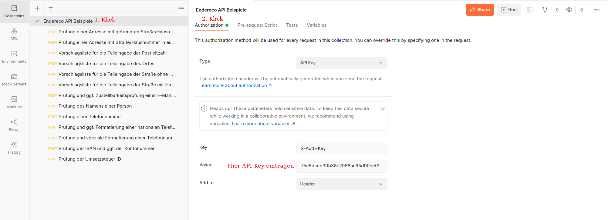

# Endereco Services API

Die Endereco Services API ermöglicht einen automatisierbaren Zugriff in Echtzeit auf
die [Services der Firma Endereco UG (haftungsb.) - Gesellschaft für Master Data Quality Management](https://www.endereco.de/services/)
. Darunter fallen die Prüfungen von internationalen postalischen Adressen aus über 200 Ländern, die Prüfung von E-Mail
Adressen, Telefonnummern, Namen und anderen Stammdaten von Personen oder Firmen.

## Über 200 Unternehmen prüfen bereits ihre Stammdaten mit Endereco

Egal ob Onlineshop, Warenwirtschaftssystem, CRM oder eine eigenentwickelte Softwarelösung — Endereco optimiert die
Qualität der Stammdaten deiner Kunden und erspart Kunden und Mitarbeiten den Mehraufwand, der durch nicht normierte und
fehlerhafte Stammdaten entsteht.

Ein Auszug unserer Referenzen:

|  |  |  |  |
|---|---|---|---|
|  |  |  |  |
|  |  |  |  |

## Plugins und fertige Intergrationen

Auf Basis unserer API entwickeln wir gemeinsam mit Integrationspartnern schlüsselfertige Produkte für verschiedene
Systeme.

||||
|---|---|---|
| [Shopware 5 Plugin](https://github.com/Endereco/endereco-shopware5-client) | [Shopware 6 Plugin](https://github.com/Endereco/endereco-shopware6-client) | [OXID eSales 4 Modul](https://github.com/Endereco/endereco-oxid4-client) |
| [OXID eSales 6 Modul](https://github.com/Endereco/endereco-oxid6-client) | [JTL Shop 4 Plugin](https://github.com/Endereco/endereco-jtl4-client) | [JTL Shop 5 Plugin](https://github.com/Endereco/endereco-jtl5-client) | 
| [WordPress/WooCommerce Plugin](https://github.com/Endereco/endereco-wp5-client) | [Magento 2 Webshop Extension](https://www.endereco.de/magento/) | [Plentymarkets Extension](https://www.endereco.de/plentymarkets/) | 
| [DreamRobot App](https://www.endereco.de/dreamrobot/) |  |  |

Wenn du Interesse hast, eine eigene Integration gegen unsere API zu entwickeln, sende eine E-Mail an
support@endereco.de.

## DSGVO konform

Unsere API ist von Grund auf so konzipiert, dass sie bei korrekter Implementierung den Ansprüchen der DSGVO gerecht
wird. Unser internes Datenschutz-Team prüft stets die aktuellen rechtlichen Anforderungen und sorgt für eine
gesetzeskonforme Umsetzung.

## Vorbereitung

Wie kannst du auf unsere API zugreifen?

1. Frage [über dieses Formular](https://share.hsforms.com/1Hez4RJSYQt2EFH_tdnCjsw3e78w) einen API-Key an. Für einen
   API-Key benötigst du mit Endereco UG eine Vereinbarung zur Auftragsverarbeitung. Nur so haben wir als Verarbeiter und
   du als Verantwortlicher die rechtliche Grundlage dafür. Die Unterlagen senden wir dir zu.
2. Probiere
   unsere [Postman-Collection](https://www.endereco.de/wp-content/uploads/2021/11/Endereco-API.postman_collection.json_.zip)
   aus. Dort sind alle gängigen Anfragen schon vorformuliert.
   Die [Import-Datei](https://www.endereco.de/wp-content/uploads/2021/11/Endereco-API.postman_collection.json_.zip)
   wurde für die aktuelle Version von [Postman](https://www.postman.com/) erstellt.
3. Falls du noch Fragen hast, such' dir den passenden Ansprechpartner aus folgender Liste aus.

### Ansprechpartner

| Art der Frage | zuständige Person | Kontakt |
|---|---|---|
| geschäftliche Fragen | Robert Rieser  |  info@endereco.de |
| technische Fragen | Ilja Weber |  support@endereco.de  |
| Fragen zur Datenschutz | Lena Schmitt | datenschutz@endereco.de |

## Übersicht der Funktionen

| Adresse | E-Mail Adresse | Person |
|---|---|---|
| [Adressprüfung](#prüfung-einer-adresse-mit-getrennter-straßehausnummer) | [E-Mail Prüfung](#prüfung-und-ggf-zustellbarkeitsprüfung-einer-e-mail-adresse) | [Namensprüfung](#prüfung-des-namens-einer-person) |
| [PLZ Vorschläge](#vorschlagsliste-für-die-teileingabe-der-postleitzahl) | | |
| [Ortsvorschläge](#vorschlagsliste-für-die-teileingabe-des-ortes) | | |
| [Straßenvorschläge](#vorschlagsliste-für-die-teileingabe-der-straße-ohne-hausnummer) | | |

| Telefonnummer | IBAN | Umsatzsteuer ID |
|---|---|---|
| [Rufnummernprüfung](#prüfung-einer-telefonnummer) | [IBAN-Prüfung](#prüfung-der-iban-und-ggf-der-kontonummer) | [Umsatzsteuer-ID Prüfung](#prüfung-der-umsatzsteuer-id) |

| technische Methoden |
|---|
| [Abschluss einer Session](./sessions-guideline.md#session) |

## Übersicht der Statuscodes und Feldbezeichnungen

Mit jeder Antwort der API auf deine Anfrage wird eine Liste von Statuscodes zurückgegeben.


Diese Statuscodes beschreiben den geprüften Datensatz und definieren die ggf. notwendigen Anpassungen, sowie die
Anzeigelogik an einem Frontend. Die [vollständige Liste der Statuscodes](./statuscodes.md) ist für alle Entwickler
hilfreich, die die Prüfungen von Endereco in ihre Geschäftsprozesse integrieren möchten.

Alle verfügbaren Feldbezeichnungen und ihre Bedeutungen sind [hier](./fields.md) erklärt.

Die Reaktionen auf bestimmte Statuscodes sind in unseren [UI Guidelines](./ui-guidelines.md) beschrieben. Diese sind für
Frontend Entwickler/Designer relevant.

## Request oder Session

Die Leistungen von Endereco sind kostenpflichtig. Dabei unterscheiden wir zwischen zwei Arten der Abrechnung.

1. Die Abrechnung je API-Anfrage
2. Die erfolgsbasierte Abrechnung

Endereco ermöglicht es Nutzern, eine Prüfung erst dann in Rechnung zu stellen, wenn diese tatsächlich einen Mehrwert
liefert. Erst wenn ein bestimmter logisch zusammenhängender Datensatz (z.B. eine Lieferadresse) nach der Verarbeitung
durch Endereco beim Nutzer verwendet oder gespeichert wird, rechnen wir ab.

Um die erfolgsbasierte Abrechnung zu ermöglichen, müssen die Anfragen in einer Session gebündelt werden. Dieses Vorgehen
haben wir in [einer Anleitung](./sessions-guideline.md) beschrieben. Jede sessionbasierte Umsetzung wird gemeinsam mit
euch von unserem Team abgenommen und vor dem Livegang freigegeben. Wenn du dazu noch Fragen hast, melde dich bei
unseren [Ansprechspartnern](#Ansprechspartner).

## Authentifizierung

Jede API-Anfrage, die an uns gesendet wird, muss einem Nutzer zugeordnet werden können. Dafür muss in der Afnrage der
HTTP-Header "X-Auth-Key" bei jeder Anfrage mit dem Wert des API-Keys gesetzt werden, den wir für dich erstellt haben.

Um unsere API über Postman anzusprechen, kannst du auch in Postman den API-Key hinterlegen. Nachdem du die
Postman-Collection importiert hast, klicke auf "Endereco API Beispiele", dann auf "Authorization" und dann wähle bei
Type "API Key" aus. Trage nun bei Key "X-Auth-Key" ein und bei Value den API-Key, den wir für dich erstellt haben. Diese
werden dann bei jedem Request zu jedem API Endpunkt im Header automatisch mitgesendet.



## Nutzung der API

Der grundsätzliche Aufbau des Protokolls entspricht
der [JSON-RPC 2.0 Spezifikation](https://www.jsonrpc.org/specification). Es muss im JSON Format formuliert werden. Die
Antwort entspricht ebenfalls dem JSON Datei Format. Die JSON wird im Body der HTTP Anfrage übermittelt.

Für die Übermittlung ist HTTPS (Port 443) zu setzen.

Aus Datenschutz-Gründen erlauben wir nur eine Server-to-Server Kommunikation. Direkte Anfragen sind nicht erlaubt. So
vermeiden wir, personenbezogene Daten des Endnutzers zu erhalten, die wir nicht brauchen.

### Verzeichnis der Methoden und Use Cases

| Methoden | Use-Case
|---| ---|
| addressCheck | [Prüfung einer Adresse mit getrennter Straße/Hausnummer ↓](#prüfung-einer-adresse-mit-getrennter-straßehausnummer)|
| ↳ | [Prüfung einer Adresse mit Straße/Hausnummer in einem Feld ↓](#prüfung-einer-adresse-mit-straßehausnummer-in-einem-feld) |
| postCodeAutocomplete | [Vorschlagsliste für die Teileingabe der Postleitzahl ↓](#vorschlagsliste-für-die-teileingabe-der-postleitzahl) |
| cityNameAutocomplete | [Vorschlagsliste für die Teileingabe des Ortes ↓](#vorschlagsliste-für-die-teileingabe-des-ortes) |
| streetAutocomplete | [Vorschlagsliste für die Teileingabe der Straße ohne Hausnummer ↓](#vorschlagsliste-für-die-teileingabe-der-straße-ohne-hausnummer) |
| ↳ | [Vorschlagsliste für die Teileingabe der Straße mit Hausnummer ↓](#vorschlagsliste-für-die-teileingabe-der-straße-mit-hausnummer) |
| emailCheck | [Prüfung und ggf. Zustellbarkeitsprüfung einer E-Mail Adresse ↓](#prüfung-und-ggf-zustellbarkeitsprüfung-einer-e-mail-adresse) |
| nameCheck | [Prüfung des Namens einer Person ↓](#prüfung-des-namens-einer-person) |
| phoneCheck | [Prüfung einer Telefonnummer ↓](#prüfung-einer-telefonnummer) |
| ↳ | [Prüfung und ggf. Formatierung einer nationalen Telefonnummer mit Ländercode ↓](#prüfung-und-ggf-formatierung-einer-nationalen-telefonnummer-mit-landescode)
| ↳ | [Prüfung und spezielle Formatierung einer Telefonnummer ↓](#prüfung-und-speziale-formatierung-einer-telefonnummer) |
| ibanCheck | [Prüfung der IBAN und ggf. der Kontonummer ↓](#prüfung-der-iban-und-ggf-der-kontonummer) |
| vatIdCheck | [Prüfung der Umsatzsteuer ID ↓](#prüfung-der-umsatzsteuer-id) |

### Prüfung einer Adresse mit getrennter Straße/Hausnummer

[zurück zur Übersicht](#verzeichnis-der-methoden-und-use-cases)

```
POST https://endereco-service.de/rpc/v1
```

#### Request Headers

|  |  |
|---|---|
| Content-Type| application/json  |
| X-Transaction-Id | not_required, siehe [Generierung der Session ID's](./sessions-guideline.md) |
| X-Agent | MyClient v1.0.0, siehe [Client ID Guideline](./client-id-guideline.md) |
| X-Transaction-Referer | www.example.de/register, siehe [Referrer übergeben](./providing-referrer.md) |
| X-Auth-Key | siehe [Authentifizierung](#authentifizierung) |

#### Body raw (JSON)

```json
{
  "jsonrpc": "2.0",
  "id": 1,
  "method": "addressCheck",
  "params": {
    "country": "DE",
    "language": "de",
    "postCode": "97232",
    "cityName": "Giebelstadt",
    "street": "Lindenstraße",
    "houseNumber": "28"
  }
}
```

Siehe [Dokumentation für Feldernamen](./fields.md).

#### Antwort Basis

```json
{
  "jsonrpc": "2.0",
  "id": 1,
  "result": {
    "predictions": [
      {
        "cityName": "Giebelstadt",
        "postCode": "97232",
        "houseNumber": "28",
        "street": "Lindenstr.",
        "country": "de"
      }
    ],
    "status": [
      "address_needs_correction",
      "A1100",
      "country_code_correct",
      "postal_code_correct",
      "locality_correct",
      "street_name_needs_correction",
      "building_number_correct"
    ]
  }
}
```

Siehe [Dokumentation für Feldernamen](./fields.md) und [Dokumentation für Status-Codes](./statuscodes.md).

#### Antwort Basis + Zusatzfunktion "Automatische Korrekturübernahme"

```json
{
  "jsonrpc": "2.0",
  "id": 1,
  "result": {
    "predictions": [
      {
        "cityName": "Giebelstadt",
        "postCode": "97232",
        "houseNumber": "28",
        "street": "Lindenstr.",
        "country": "de"
      }
    ],
    "status": [
      "address_needs_correction",
      "A1100",
      "country_code_correct",
      "postal_code_correct",
      "locality_correct",
      "street_name_needs_correction",
      "street_name_minor_correction",
      "building_number_correct",
      "address_minor_correction"
    ]
  }
}
```

Siehe [Dokumentation für Feldernamen](./fields.md) und [Dokumentation für Status-Codes](./statuscodes.md).

#### Antwort Basis + Zusatzfunktion "Hausnummernexistenzprüfung"

```json
{
  "jsonrpc": "2.0",
  "id": 1,
  "result": {
    "predictions": [],
    "status": [
      "address_needs_correction",
      "A1100",
      "country_code_correct",
      "postal_code_correct",
      "locality_correct",
      "street_name_needs_correction",
      "building_number_needs_correction",
      "building_number_not_found"
    ]
  }
}
```

Siehe [Dokumentation für Feldernamen](./fields.md) und [Dokumentation für Status-Codes](./statuscodes.md).

### Prüfung einer Adresse mit Straße/Hausnummer in einem Feld

[zurück zur Übersicht](#verzeichnis-der-methoden-und-use-cases)

```
POST https://endereco-service.de/rpc/v1
```

#### Request Headers

|  |  |
|---|---|
| Content-Type| application/json  |
| X-Transaction-Id | not_required, siehe [Generierung der Session ID's](./sessions-guideline.md) |
| X-Agent | MyClient v1.0.0, siehe [Client ID Guideline](./client-id-guideline.md) |
| X-Transaction-Referer | www.example.de/register, siehe [Referrer übergeben](./providing-referrer.md) |
| X-Auth-Key | siehe [Authentifizierung](#authentifizierung) |

#### Body raw (JSON)

```json
{
  "jsonrpc": "2.0",
  "id": 1,
  "method": "addressCheck",
  "params": {
    "country": "DE",
    "language": "de",
    "postCode": "97232",
    "cityName": "Giebelstadt",
    "streetFull": "Lindenstraße 28"
  }
}
```

Siehe [Dokumentation für Feldernamen](./fields.md).

#### Antwort Basis

```json
{
  "jsonrpc": "2.0",
  "id": 1,
  "result": {
    "predictions": [
      {
        "cityName": "Giebelstadt",
        "postCode": "97232",
        "houseNumber": "28",
        "street": "Lindenstr.",
        "country": "de"
      }
    ],
    "status": [
      "address_needs_correction",
      "A1100",
      "country_code_correct",
      "postal_code_correct",
      "locality_correct",
      "street_name_needs_correction",
      "building_number_correct"
    ]
  }
}
```

Siehe [Dokumentation für Feldernamen](./fields.md) und [Dokumentation für Status-Codes](./statuscodes.md).

#### Antwort Basis + Zusatzfunktion "Automatische Korrekturübernahme"

```json
{
  "jsonrpc": "2.0",
  "id": 1,
  "result": {
    "predictions": [
      {
        "cityName": "Giebelstadt",
        "postCode": "97232",
        "houseNumber": "28",
        "street": "Lindenstr.",
        "country": "de"
      }
    ],
    "status": [
      "address_needs_correction",
      "A1100",
      "country_code_correct",
      "postal_code_correct",
      "locality_correct",
      "street_name_needs_correction",
      "street_name_minor_correction",
      "building_number_correct",
      "address_minor_correction"
    ]
  }
}
```

Siehe [Dokumentation für Feldernamen](./fields.md) und [Dokumentation für Status-Codes](./statuscodes.md).

#### Antwort Basis + Zusatzfunktion "Hausnummernexistenzprüfung"

```json
{
  "jsonrpc": "2.0",
  "id": 1,
  "result": {
    "predictions": [],
    "status": [
      "address_needs_correction",
      "A1100",
      "country_code_correct",
      "postal_code_correct",
      "locality_correct",
      "street_name_needs_correction",
      "building_number_needs_correction",
      "building_number_not_found"
    ]
  }
}
```

Siehe [Dokumentation für Feldernamen](./fields.md) und [Dokumentation für Status-Codes](./statuscodes.md).

### Vorschlagsliste für die Teileingabe der Postleitzahl

[zurück zur Übersicht](#verzeichnis-der-methoden-und-use-cases)

```
POST https://endereco-service.de/rpc/v1
```

#### Request Headers

|  |  |
|---|---|
| Content-Type| application/json  |
| X-Transaction-Id | not_required, siehe [Generierung der Session ID's](./sessions-guideline.md) |
| X-Agent | MyClient v1.0.0, siehe [Client ID Guideline](./client-id-guideline.md) |
| X-Transaction-Referer | www.example.de/register, siehe [Referrer übergeben](./providing-referrer.md) |
| X-Auth-Key | siehe [Authentifizierung](#authentifizierung) |

#### Body raw (JSON)

```json
{
  "jsonrpc": "2.0",
  "id": 1,
  "method": "postCodeAutocomplete",
  "params": {
    "country": "DE",
    "language": "de",
    "postCode": "972"
  }
}
```

Siehe [Dokumentation für Feldernamen](./fields.md).

#### Antwort Basis

```json
{
  "jsonrpc": "2.0",
  "id": 1,
  "result": {
    "predictions": [
      {
        "cityName": "Höchberg",
        "postCode": "97204"
      },
      {
        "cityName": "Veitshöchheim",
        "postCode": "97209"
      },
      {
        "cityName": "Simmershofen",
        "postCode": "97215"
      },
      {
        "cityName": "Uffenheim",
        "postCode": "97215"
      },
      {
        "cityName": "Weigenheim",
        "postCode": "97215"
      },
      {
        "cityName": "Gerbrunn",
        "postCode": "97218"
      },
      {
        "cityName": "Rimpar",
        "postCode": "97222"
      },
      {
        "cityName": "Zellingen",
        "postCode": "97225"
      },
      {
        "cityName": "Rottendorf",
        "postCode": "97228"
      }
    ],
    "status": [
      "A2000"
    ]
  }
}
```

Siehe [Dokumentation für Feldernamen](./fields.md) und [Dokumentation für Status-Codes](./statuscodes.md).

### Vorschlagsliste für die Teileingabe des Ortes

[zurück zur Übersicht](#verzeichnis-der-methoden-und-use-cases)

```
POST https://endereco-service.de/rpc/v1
```

#### Request Headers

|  |  |
|---|---|
| Content-Type| application/json  |
| X-Transaction-Id | not_required, siehe [Generierung der Session ID's](./sessions-guideline.md) |
| X-Agent | MyClient v1.0.0, siehe [Client ID Guideline](./client-id-guideline.md) |
| X-Transaction-Referer | www.example.de/register, siehe [Referrer übergeben](./providing-referrer.md) |
| X-Auth-Key | siehe [Authentifizierung](#authentifizierung) |

#### Body raw (JSON)

```json
{
  "jsonrpc": "2.0",
  "id": 1,
  "method": "cityNameAutocomplete",
  "params": {
    "country": "DE",
    "language": "de",
    "cityName": "Wü"
  }
}
```

Siehe [Dokumentation für Feldernamen](./fields.md).

#### Antwort Basis

```json
{
  "jsonrpc": "2.0",
  "id": 1,
  "result": {
    "predictions": [
      {
        "cityName": "Wülfershausen",
        "postCode": "97618"
      },
      {
        "cityName": "Wülfrath",
        "postCode": "42489"
      },
      {
        "cityName": "Wülknitz",
        "postCode": "01609"
      },
      {
        "cityName": "Wülknitz",
        "postCode": "06369"
      },
      {
        "cityName": "Wülperode",
        "postCode": "38835"
      },
      {
        "cityName": "Wünsch",
        "postCode": "06255"
      },
      {
        "cityName": "Wünschbach",
        "postCode": "64753"
      }
    ],
    "status": [
      "A2000"
    ]
  }
}
```

Siehe [Dokumentation für Feldernamen](./fields.md) und [Dokumentation für Status-Codes](./statuscodes.md).

### Vorschlagsliste für die Teileingabe der Straße ohne Hausnummer

[zurück zur Übersicht](#verzeichnis-der-methoden-und-use-cases)

```
POST https://endereco-service.de/rpc/v1
```

#### Request Headers

|  |  |
|---|---|
| Content-Type| application/json  |
| X-Transaction-Id | not_required, siehe [Generierung der Session ID's](./sessions-guideline.md) |
| X-Agent | MyClient v1.0.0, siehe [Client ID Guideline](./client-id-guideline.md) |
| X-Transaction-Referer | www.example.de/register, siehe [Referrer übergeben](./providing-referrer.md) |
| X-Auth-Key | siehe [Authentifizierung](#authentifizierung) |

#### Body raw (JSON)

```json
{
  "jsonrpc": "2.0",
  "id": 1,
  "method": "streetAutocomplete",
  "params": {
    "country": "DE",
    "language": "de",
    "cityName": "Würzburg",
    "postCode": "97070",
    "street": "Am "
  }
}
```

Siehe [Dokumentation für Feldernamen](./fields.md).

#### Antwort Basis

```json
{
  "jsonrpc": "2.0",
  "id": 1,
  "result": {
    "predictions": [
      {
        "street": "Am Bruderhof",
        "streetName": "Am Bruderhof",
        "buildingNumber": "",
        "additionalInfo": ""
      },
      {
        "street": "Am Pleidenturm",
        "streetName": "Am Pleidenturm",
        "buildingNumber": "",
        "additionalInfo": ""
      }
    ],
    "status": [
      "A2000"
    ]
  }
}
```

Siehe [Dokumentation für Feldernamen](./fields.md) und [Dokumentation für Status-Codes](./statuscodes.md).

### Vorschlagsliste für die Teileingabe der Straße mit Hausnummer

[zurück zur Übersicht](#verzeichnis-der-methoden-und-use-cases)

```
POST https://endereco-service.de/rpc/v1
```

#### Request Headers

|  |  |
|---|---|
| Content-Type| application/json  |
| X-Transaction-Id | not_required, siehe [Generierung der Session ID's](./sessions-guideline.md) |
| X-Agent | MyClient v1.0.0, siehe [Client ID Guideline](./client-id-guideline.md) |
| X-Transaction-Referer | www.example.de/register, siehe [Referrer übergeben](./providing-referrer.md) |
| X-Auth-Key | siehe [Authentifizierung](#authentifizierung) |

#### Body raw (JSON)

```json
{
  "jsonrpc": "2.0",
  "id": 1,
  "method": "streetAutocomplete",
  "params": {
    "country": "DE",
    "language": "de",
    "cityName": "Würzburg",
    "postCode": "97070",
    "streetFull": "Am B 3"
  }
}
```

Siehe [Dokumentation für Feldernamen](./fields.md).

#### Antwort Basis

```json
{
  "jsonrpc": "2.0",
  "id": 1,
  "result": {
    "predictions": [
      {
        "street": "Am Bruderhof",
        "streetName": "Am Bruderhof",
        "buildingNumber": "3",
        "additionalInfo": ""
      }
    ],
    "status": [
      "A1000"
    ]
  }
}
```

Siehe [Dokumentation für Feldernamen](./fields.md) und [Dokumentation für Status-Codes](./statuscodes.md).

### Prüfung und ggf. Zustellbarkeitsprüfung einer E-Mail Adresse

[zurück zur Übersicht](#verzeichnis-der-methoden-und-use-cases)

```
POST https://endereco-service.de/rpc/v1
```

#### Request Headers

|  |  |
|---|---|
| Content-Type| application/json  |
| X-Transaction-Id | not_required, siehe [Generierung der Session ID's](./sessions-guideline.md) |
| X-Agent | MyClient v1.0.0, siehe [Client ID Guideline](./client-id-guideline.md) |
| X-Transaction-Referer | www.example.de/register, siehe [Referrer übergeben](./providing-referrer.md) |
| X-Auth-Key | siehe [Authentifizierung](#authentifizierung) |

#### Body raw (JSON)

rodrigo@endereco.de ist eine richtig formatierte, aber nicht zustellbare E-Mail Adresse.

```json
{
  "jsonrpc": "2.0",
  "id": 1,
  "method": "emailCheck",
  "params": {
    "email": "rodrigo@endereco.de"
  }
}
```

Siehe [Dokumentation für Feldernamen](./fields.md).

#### Antwort Basis

```json
{
  "jsonrpc": "2.0",
  "id": 1,
  "result": {
    "status": [
      "A1000",
      "email_correct"
    ]
  }
}
```

Siehe [Dokumentation für Feldernamen](./fields.md) und [Dokumentation für Status-Codes](./statuscodes.md).

#### Antwort Basis + Zusatzfunktion "Zustellbarkeitsprüfung"

```json
{
  "jsonrpc": "2.0",
  "id": 1,
  "result": {
    "status": [
      "A4000",
      "A4700"
    ]
  }
}
```

Siehe [Dokumentation für Feldernamen](./fields.md) und [Dokumentation für Status-Codes](./statuscodes.md).

### Prüfung des Namens einer Person

[zurück zur Übersicht](#verzeichnis-der-methoden-und-use-cases)

```
POST https://endereco-service.de/rpc/v1
```

#### Request Headers

|  |  |
|---|---|
| Content-Type| application/json  |
| X-Transaction-Id | not_required, siehe [Generierung der Session ID's](./sessions-guideline.md) |
| X-Agent | MyClient v1.0.0, siehe [Client ID Guideline](./client-id-guideline.md) |
| X-Transaction-Referer | www.example.de/register, siehe [Referrer übergeben](./providing-referrer.md) |
| X-Auth-Key | siehe [Authentifizierung](#authentifizierung) |

#### Body raw (JSON)

```json
{
  "jsonrpc": "2.0",
  "id": 1,
  "method": "nameCheck",
  "params": {
    "salutation": "m",
    "firstName": "julia",
    "lastName": "Schenk"
  }
}
```

Siehe [Dokumentation für Feldernamen](./fields.md).

#### Antwort Basis

```json
{
  "jsonrpc": "2.0",
  "id": 1,
  "result": {
    "predictions": [
      {
        "salutation": "f",
        "firstName": "Julia",
        "lastName": "Schenk"
      }
    ],
    "status": [
      "name_is_natural_person",
      "salutation_needs_correction",
      "first_name_needs_correction",
      "name_needs_correction"
    ]
  }
}
```

Siehe [Dokumentation für Feldernamen](./fields.md) und [Dokumentation für Status-Codes](./statuscodes.md).

#### Antwort Basis + Zusatzfunktion "Echtheitsprüfung der Person"

```json
{
  "jsonrpc": "2.0",
  "id": 1,
  "result": {
    "score": "1.00",
    "predictions": [
      {
        "salutation": "f",
        "firstName": "Julia",
        "lastName": "Schenk"
      }
    ],
    "status": [
      "name_is_natural_person",
      "salutation_needs_correction",
      "first_name_needs_correction",
      "name_needs_correction",
      "name_is_real"
    ]
  }
}
```

Siehe [Dokumentation für Feldernamen](./fields.md) und [Dokumentation für Status-Codes](./statuscodes.md).

### Prüfung einer Telefonnummer

[zurück zur Übersicht](#verzeichnis-der-methoden-und-use-cases)

```
POST https://endereco-service.de/rpc/v1
```

#### Request Headers

|  |  |
|---|---|
| Content-Type| application/json  |
| X-Transaction-Id | not_required, siehe [Generierung der Session ID's](./sessions-guideline.md) |
| X-Agent | MyClient v1.0.0, siehe [Client ID Guideline](./client-id-guideline.md) |
| X-Transaction-Referer | www.example.de/register, siehe [Referrer übergeben](./providing-referrer.md) |
| X-Auth-Key | siehe [Authentifizierung](#authentifizierung) |

#### Body raw (JSON)

```json
{
  "jsonrpc": "2.0",
  "id": 1,
  "method": "phoneCheck",
  "params": {
    "phone": "+491796862470"
  }
}
```

Siehe [Dokumentation für Feldernamen](./fields.md).

#### Antwort Basis

```json
{
  "jsonrpc": "2.0",
  "id": 1,
  "result": {
    "original": {
      "phone": "+491796862470"
    },
    "status": [
      "phone_format_e164",
      "phone_is_mobile",
      "phone_correct"
    ],
    "predictions": [
      {
        "phone": "+491796862470",
        "formatNational": "0179 6862470",
        "formatInternational": "+49 179 6862470",
        "formatE164": "+491796862470",
        "formatRFC3966": "tel:+49-179-6862470",
        "region": "Germany",
        "carrier": "O2",
        "countryPrefix": "+49",
        "nationalNumber": "1796862470",
        "nationalPrefix": "0179",
        "nationalBody": "6862470",
        "leadingZeros": 1
      }
    ]
  }
}
```

Siehe [Dokumentation für Feldernamen](./fields.md) und [Dokumentation für Status-Codes](./statuscodes.md).

### Prüfung und ggf. Formatierung einer nationalen Telefonnummer mit Landescode

[zurück zur Übersicht](#verzeichnis-der-methoden-und-use-cases)

```
POST https://endereco-service.de/rpc/v1
```

#### Request Headers

|  |  |
|---|---|
| Content-Type| application/json  |
| X-Transaction-Id | not_required, siehe [Generierung der Session ID's](./sessions-guideline.md) |
| X-Agent | MyClient v1.0.0, siehe [Client ID Guideline](./client-id-guideline.md) |
| X-Transaction-Referer | www.example.de/register, siehe [Referrer übergeben](./providing-referrer.md) |
| X-Auth-Key | siehe [Authentifizierung](#authentifizierung) |

#### Body raw (JSON)

```json
{
  "jsonrpc": "2.0",
  "id": 1,
  "method": "phoneCheck",
  "params": {
    "phone": "017680728912",
    "countryCode": "DE"
  }
}
```

Siehe [Dokumentation für Feldernamen](./fields.md).

#### Antwort Basis

```json
{
  "jsonrpc": "2.0",
  "id": 1,
  "result": {
    "original": {
      "phone": "017680728912"
    },
    "status": [
      "phone_format_undefined",
      "phone_is_mobile",
      "phone_correct"
    ],
    "predictions": [
      {
        "phone": "017680728912",
        "formatNational": "0176 80728912",
        "formatInternational": "+49 176 80728912",
        "formatE164": "+4917680728912",
        "formatRFC3966": "tel:+49-176-80728912",
        "region": "Germany",
        "carrier": "O2",
        "countryPrefix": "+49",
        "nationalNumber": "17680728912",
        "nationalPrefix": "0176",
        "nationalBody": "80728912",
        "leadingZeros": 1
      }
    ]
  }
}
```

Siehe [Dokumentation für Feldernamen](./fields.md) und [Dokumentation für Status-Codes](./statuscodes.md).

### Prüfung und speziale Formatierung einer Telefonnummer + zus. Funktion HLR-Lookup

[zurück zur Übersicht](#verzeichnis-der-methoden-und-use-cases)

```
POST https://endereco-service.de/rpc/v1
```

#### Request Headers

|  |  |
|---|---|
| Content-Type| application/json  |
| X-Transaction-Id | not_required, siehe [Generierung der Session ID's](./sessions-guideline.md) |
| X-Agent | MyClient v1.0.0, siehe [Client ID Guideline](./client-id-guideline.md) |
| X-Transaction-Referer | www.example.de/register, siehe [Referrer übergeben](./providing-referrer.md) |
| X-Auth-Key | siehe [Authentifizierung](#authentifizierung) |

#### Body raw (JSON)

```json
{
  "jsonrpc": "2.0",
  "id": 1,
  "method": "phoneCheck",
  "params": {
    "phone": "017680728912",
    "countryCode": "DE",
    "format": "international"
  }
}
```

Siehe [Dokumentation für Feldernamen](./fields.md).

#### Antwort Basis

```json
{
  "jsonrpc": "2.0",
  "id": 1,
  "result": {
    "original": {
      "phone": "017680728912"
    },
    "status": [
      "phone_format_undefined",
      "phone_is_mobile",
      "phone_format_needs_correction",
      "phone_invalid",
      "phone_hlr_lookup_failed"
    ],
    "predictions": [
      {
        "phone": "+49 176 80728912",
        "formatNational": "0176 80728912",
        "formatInternational": "+49 176 80728912",
        "formatE164": "+4917680728912",
        "formatRFC3966": "tel:+49-176-80728912",
        "region": "Germany",
        "carrier": "Telefónica Germany GmbH & Co. oHG (O2)",
        "countryPrefix": "+49",
        "nationalNumber": "17680728912",
        "nationalPrefix": "0176",
        "nationalBody": "80728912",
        "leadingZeros": 1
      }
    ]
  }
}
```

Siehe [Dokumentation für Feldernamen](./fields.md) und [Dokumentation für Status-Codes](./statuscodes.md).

### Prüfung der IBAN und ggf. der Kontonummer

[zurück zur Übersicht](#verzeichnis-der-methoden-und-use-cases)

```
POST https://endereco-service.de/rpc/v1
```

#### Request Headers

|  |  |
|---|---|
| Content-Type| application/json  |
| X-Transaction-Id | not_required, siehe [Generierung der Session ID's](./sessions-guideline.md) |
| X-Agent | MyClient v1.0.0, siehe [Client ID Guideline](./client-id-guideline.md) |
| X-Transaction-Referer | www.example.de/register, siehe [Referrer übergeben](./providing-referrer.md) |
| X-Auth-Key | siehe [Authentifizierung](#authentifizierung) |

#### Body raw (JSON)

```json
{
  "jsonrpc": "2.0",
  "id": 1,
  "method": "ibanCheck",
  "params": {
    "iban": "DE89 3704 0044 0532 0130 00"
  }
}
```

Siehe [Dokumentation für Feldernamen](./fields.md).

#### Antwort Basis

```json
{
  "jsonrpc": "2.0",
  "id": 1,
  "result": {
    "original": {
      "iban": "DE89 3704 0044 0532 0130 00"
    },
    "status": [
      "iban_needs_correction",
      "iban_checksum_correct",
      "iban_length_correct",
      "iban_is_sepa"
    ],
    "predictions": [
      {
        "iban": "DE89370400440532013000",
        "countryCode": "DE",
        "checksum": "89",
        "bankCode": "37040044",
        "bankName": "Commerzbank",
        "bankPostalCode": "50447",
        "bankLocality": "Köln",
        "bankShortName": "Commerzbank Köln",
        "bic": "COBADEFFXXX",
        "accountNumber": "0532013000",
        "countryCentralBankName": "Deutsche Bundesbank",
        "countryCentralBankUrl": "http://www.bundesbank.de/"
      }
    ]
  }
}
```

Siehe [Dokumentation für Feldernamen](./fields.md) und [Dokumentation für Status-Codes](./statuscodes.md).

#### Antwort Basis + Zusatzfunktion "Kontonummer verifizieren"

```json
{
  "jsonrpc": "2.0",
  "id": 1,
  "result": {
    "original": {
      "iban": "DE89 3704 0044 0532 0130 00"
    },
    "status": [
      "iban_needs_correction",
      "iban_checksum_correct",
      "iban_length_correct",
      "iban_is_sepa",
      "iban_account_correct",
      "iban_account_checkmethod_13"
    ],
    "predictions": [
      {
        "iban": "DE89370400440532013000",
        "countryCode": "DE",
        "checksum": "89",
        "bankCode": "37040044",
        "bankName": "Commerzbank",
        "bankPostalCode": "50447",
        "bankLocality": "Köln",
        "bankShortName": "Commerzbank Köln",
        "bic": "COBADEFFXXX",
        "accountNumber": "0532013000",
        "countryCentralBankName": "Deutsche Bundesbank",
        "countryCentralBankUrl": "http://www.bundesbank.de/"
      }
    ]
  }
}
```

Siehe [Dokumentation für Feldernamen](./fields.md) und [Dokumentation für Status-Codes](./statuscodes.md).

### Prüfung der Umsatzsteuer ID

[zurück zur Übersicht](#verzeichnis-der-methoden-und-use-cases)

```
POST https://endereco-service.de/rpc/v1
```

#### Request Headers

|  |  |
|---|---|
| Content-Type| application/json  |
| X-Transaction-Id | not_required, siehe [Generierung der Session ID's](./sessions-guideline.md) |
| X-Agent | MyClient v1.0.0, siehe [Client ID Guideline](./client-id-guideline.md) |
| X-Transaction-Referer | www.example.de/register, siehe [Referrer übergeben](./providing-referrer.md) |
| X-Auth-Key | siehe [Authentifizierung](#authentifizierung) |

#### Body raw (JSON)

```json
{
  "jsonrpc": "2.0",
  "id": 1,
  "method": "vatIdCheck",
  "params": {
    "vatId": "DE214205098"
  }
}
```

Siehe [Dokumentation für Feldernamen](./fields.md).

#### Antwort Basis

```json
{
  "jsonrpc": "2.0",
  "id": 1,
  "result": {
    "status": [
      "vat_valid"
    ]
  }
}
```

Siehe [Dokumentation für Feldernamen](./fields.md) und [Dokumentation für Status-Codes](./statuscodes.md).
