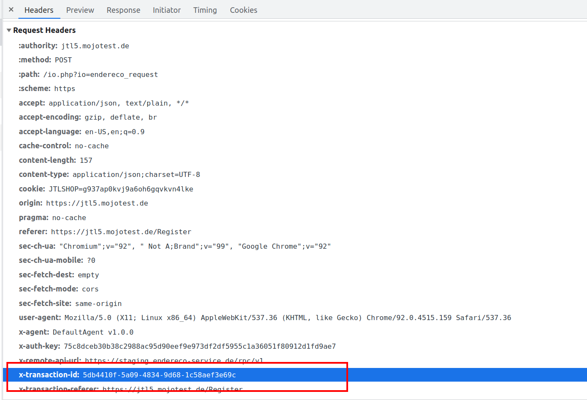

# Sessions Guideline

## Unterschied zwischen Abrechnung pro Anfrage und Abrechnung pro Datensatz

Die einfachste Art Endereco Services API zu nutzen ist die Anfragen zu senden und pro Anfrage abgerechnet zu werden.
Jede Anfrage wird einzeln erfasst und getrennt von anderen gezählt.

Das Problem bei dieser Vorgehensweise ist jedoch, dass nicht jede Anfrage tatsächlich einen Mehrwert für den Nutzer hat.
So kann jemand zwar eine Adresse eingeben, aber im letzten Moment seine Registrierung abbrechen und die Webseite
verlassen. Man würde somit für Eingabeassistent und ggf. Adressprüfung zahlen, obwohl man sie nicht gebraucht hat.

Um es möglichst fair zu gestalten, bietet Endereco eine sog. "erfolgsbasierte Abrechnung". Damit ist gemeint, dass
Endereco nur dann abrechnet, wenn die Services tatsächlich etwas gebracht haben.

Technisch formuliert sieht das so aus.

Abrechnung erfolgt nicht pro Anfrage, sondern pro gespeicherter Datensatz. Ein Datensatz kann eine Lieferadresse, eine
Telefonnummer, ein Name, etc. sein.

Um ein Datensatz zu erfassen ist manchmal die Nutzung von mehreren Funktionen der API notwendig. Zum Beispiel um eine
Adresse zu erfassen, wird zuerst PLZ- und Ortseingabehilfe verwendet, danach Straßeneingabehilfe und abschließend die
Adressprüfung für die gesamte Adresse. Je nach Eingabe und Korrekturvorschlägen können danach noch weitere
Adressprüfungen folgen.

Wird der Datensatz danach im Zielsystem gespeichert, wird er einmalig abgerechnet.

Damit Endereco Services API diesen Vorgang korrekt registrieren kann, sind einige weitere Metainformationen notwendig.
Diese müssen bei individueller Entwicklung selbst umgesetzt werden.

Dafür stellen wir zuerst zwei Konzepte vor:

- Session
- Abschluss einer Session

## Session

Eine Session ist der Prozess der Datensatzerfassung.

Sie hat eine eindeutige ID. Die ID ist eindeutig, wenn sie zufällig generiert wird und innerhalb von einem Monat nur
einmal vorkommt.

Jede Anfrage innerhalb der Session muss die Session ID im Header `x-transaction-id` übermitteln.



Dadurch kann Endereco Services API serverseitig die Anfragen zusammenfassen.

**Wichtig!** Jeder Datensatz und jede neue Datenerfassung soll eine eigene Session ID besitzen.

### Best Practice von Endereco. UUID v4 generieren.

Wir setzen [UUID v4](https://en.wikipedia.org/wiki/Universally_unique_identifier#Version_4_(random)) als Session ID ein.

Es gibt zahlreiche freie Bibliotheken, die diese ID in diversen Programmiersprachen implementieren.

Zum Beispiel PHP:

```shell
 composer require ramsey/uuid
```

```php
// datei.php

require './vendor/autoload.php';

use Ramsey\Uuid\Uuid;

$uuid = Uuid::uuid4();

echo $uuid;

// output: c07968ba-ec38-4cf2-8819-5b9c70b78a72
```

Beispiel JavaScript:

```shell
npm i uuidv4
```

```javascript
import {uuid} from 'uuidv4';

console.log(uuid());
// output: fe82c91a-7b02-44bd-93fc-1badb42666c7
```

## Abschluss der Session

Wenn im Laufe der Datenerfassung der Datensatz gespeichert wird, egal ob in der Datei, Datenbank, Session-Variable,
Cookie, localStorage, erwartet Endereco Services API eine Meldung darüber.

Die Meldung ist eine spezielle Anfrage, die wie jede andere Anfrage an Endereco Service API gesendet werden muss.

Die Anfrage wird so formuliert:

```
POST https://endereco-service.de/rpc/v1
```

#### Request Headers

|  |  |
|---|---|
| Content-Type| application/json  |
| X-Transaction-Id | not_required, siehe [Generierung der Session ID's](./sessions-guideline.md) |
| X-Agent | MyClient v1.0.0, siehe [Client ID Guideline](./client-id-guideline.md) |
| X-Transaction-Referer | www.example.de/register, siehe [Referrer übergeben](./providing-referrer.md) |
| X-Auth-Key | siehe [Authentifizierung](#authentifizierung) |

#### Body raw (JSON)

```json
{
  "jsonrpc": "2.0",
  "id": 1,
  "method": "doAccounting",
  "params": {
    "sessionsId": "c07968ba-ec38-4cf2-8819-5b9c70b78a72"
  }
}
```

Siehe [Dokumentation für Felder](./fields.md). Die Session ID kommt hierbei doppelt vor: einmal im Header und einmal
als "sessionId"-Parameter. Der Grund dafür ist, dass wir zukünftig Abschluss mehrerer Sessions über einen Aufruf
ermöglichen wollen. Aktueller Stand ist die Übergangsphase.

#### Antwort

```json
{
  "jsonrpc": "2.0",
  "id": 1,
  "result": {
    "status": [
      "A1000"
    ]
  }
}
```

## Nutzung der JS-SDK

Falls in der Implementierung die [JS-SDK](https://github.com/Endereco/js-sdk) genutzt wird, dann kann die Generierung
der Session ID übersprungen werden. Diese Aufgabe wird von [JS-SDK](https://github.com/Endereco/js-sdk) erledigt.

Die Session ID's werden dabei als hidden input hinterlegt und beim Absenden der Form mit übermittelt.

Die Aufgabe des Entwicklers besteht darin die so übermittelte Session ID's serverseitig zu empfangen und mittels "
doAccounting" and die Endereco Service API zu übermitteln.

## Abnahme der Eigenimplementierung durch Endereco

Wenn die erfolgsbasierte Abrechnung implementiert wird, muss die Implementation zwingend durch Endereco abgenommen
werden. Dafür ist ein Termin auszumachen.

Vor der Abnahme ist nur die anfragenbasierte Abrechnung möglich.

## Hilfe und Schulung

Falls diese Guideline das Thema nicht ausreichen erklärt hat bzw. noch weitere Fragen bestehen, stehen
unsere [Ansprechspartnern](./readme.md#Ansprechspartner) zur Verfügung.
