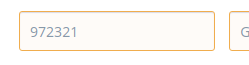
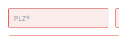
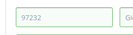
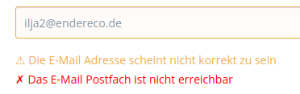
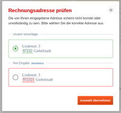
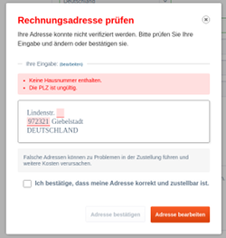

# Ui Guidelines

Falls ein Datensatz über Endereco API geprüft wird, werden in der Regel diverse Statuscodes zurückgegeben. 
Diese Statuscodes können einfach über Automatisierungen eingesetzt werden, jedoch kann ein normaler Benutzer mit ihnen nichts anfangen. 
Für ihn ist eine klare UI notwendig.

In diesem Dokument beschreiben wir von uns vorgesehene UI für diverse Verfahren, die unsere API abbilden kann.

## UI Elemente

| Element | Beispiel | Bedeutung |
|---|---|---|
| orangene Umrandung und Hintergrund der Eingabefelder |  | Warnung! Der Inhalt soll wahrscheinlich korrigiert werden. |
| rote Umrandung und Hintergrund der Eingabefelder |  | Fehler! Der Inhalt ist wahrscheinlich falsch. |
| grüne Umrandung und Hintergrund der Eingabefelder |  | Geprüft! Der Inhalt wurde geprüft und ist richtig. |
| orangene Warnung unter dem Eingabefeld |  | Warnung! In der Eingabe wurde möglicherweise ein Fehler gemacht. Die Warnung spezifiziert was falsch sein könnte.  |
| rote Fehlermeldung unter dem Eingabefeld |  | Fehler! In der Eingabe wurde wahrscheinlich ein Fehler gemacht. Die Fehlermeldung spezifiziert den Fehler. |
| Modal mit Korrekturvorschlägen |  | Bei Datensätzen, die aus mehreren Teilen bestehen, ist es einfacher die Korrekturen auf einem Schlag zu erledigen. Dafür ist ein Modal mit der ursprünglichen Eingabe und den Korrekturvorschlägen zu verwenden. Mehr dazu in [Modal](#modal). |
| Modal ohne Korrekturvorschlägen |  | Bei Datensätzen, die aus mehreren Teilen bestehen, für die jedoch kein Korrekturvorschlag vorliegt, soll auch ein Modal eingesetzt werden. Mehr dazu in [Modal](#modal). |

## Modal

## Prüfung von Namen

Wenn ein Name geprüft wird, können wir kleine Schreibfehler (erster Buchstabe kleingeschrieben) erkennen. Wir erkennen 
außerdem, Vorname und Nachname verdreht wurden und ob die Anrede untypisch ist, z.B. "Herr" bei eindeutig weiblichen Namen.

Wenn die Namensprüfung einen Statuscode "name_needs_correction" zurückgibt, dann ist aus unserer Sicht eine Korrektur notwendig. Das Eingabefeld soll in diesem Fall mit orange

## Prüfung von Adressen

## Prüfung von E-Mail Adressen

## Prüfung von Telefonnummern

## Prüfung von IBAN

## Prüfung von Umsatzsteuer ID
